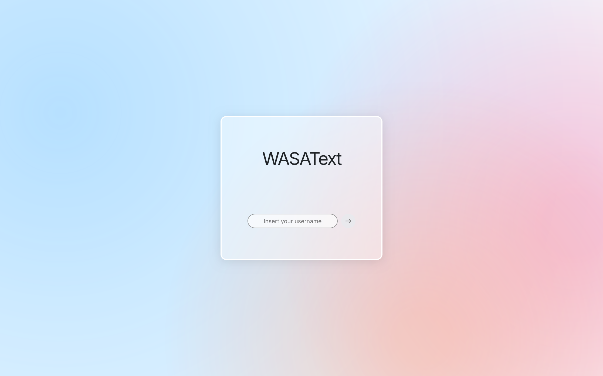
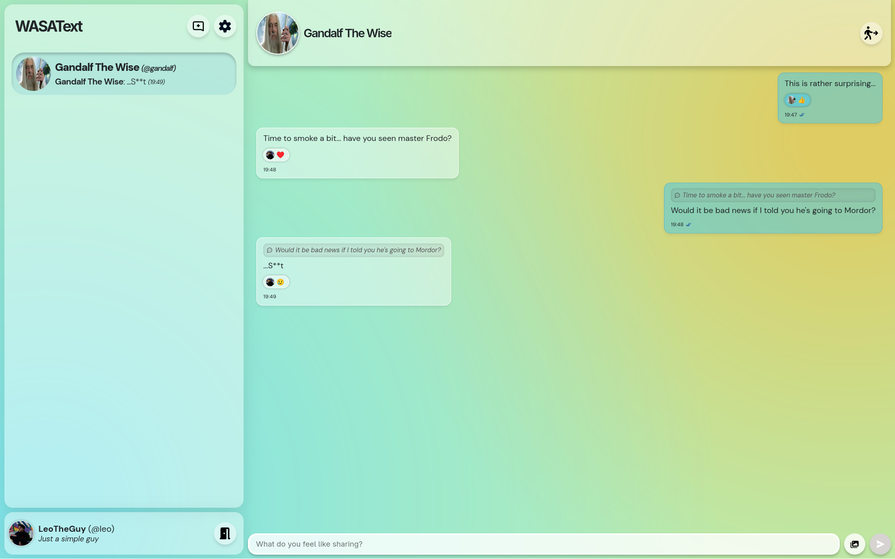
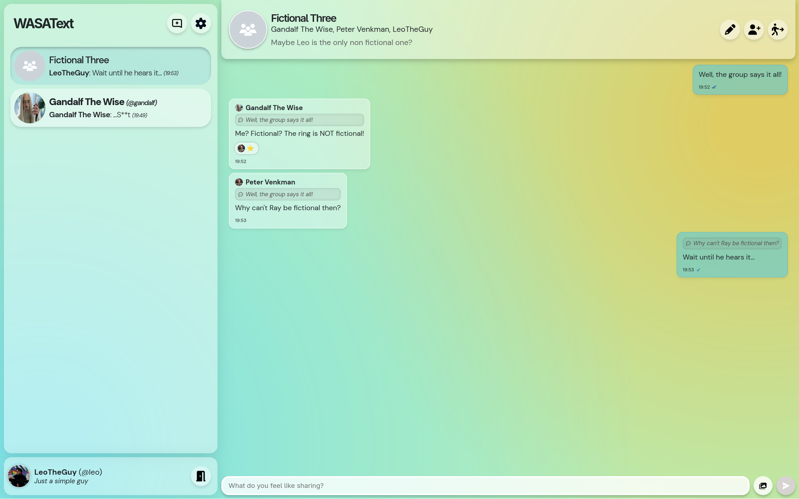

<h1 align="center">WASAText</h1>
<p align="center">Repository for the WASAText project, for the WASA course @ Sapienza</p>

## What is WASAText?

WASAText is the name of a Single Page Application made for the Web And Software Architecture course @ Sapienza. The project consists of a web-based messaging application, comprising both **backend** and **frontend**. Some of its features are:
 - Real-time sending and receiving of messages;
 - Creation of private and group chats;
 - Customization of a user profile;
 - Message operations such as reply, forward and delete;
 - Possibility to add reactions.

## Spinning it up

Running WASAText is really easy: just open the shell and execute the following:

```sh
curl https://github.com/ElBi21/WASA/archive/refs/heads/main.zip
unzip "WASA-main.zip" -d WASA && cd WASA
docker compose up -d
```

And voilà, you'll be ready to go! You can open up an instance of the project at `localhost`

## How does it look?

Judge by yourself! When launched, the application will greet you with the following screen:



To login, just choose a username. If the username exists, you will be logged in, otherwise you will be guided through the creation of a new user. After logging in, you can do what you would do in any other messaging application: create chats and exchange messages with your friends. Heck, you can even send photos!





## Technologies used

The project is made of 3 main sections:
 - API description, through the **OpenAPI** standard;
 - Backend, realized in **Go**;
 - Frontend, realized in **Vue.js**.

All the three parts are linked through Docker. A Docker compose file links the backend and the frontend containers.

## License & Scope of the project

This project is based on the "[Fantastic Coffee (Decaffeinated)](https://github.com/sapienzaapps/fantastic-coffee-decaffeinated)" template provided by the course instructors under the [MIT LICENSE](LICENSE). This project was moreover intended only for academic purpouses: many things have been simplified because of it, so the project is not ready for any kind of production environment.
